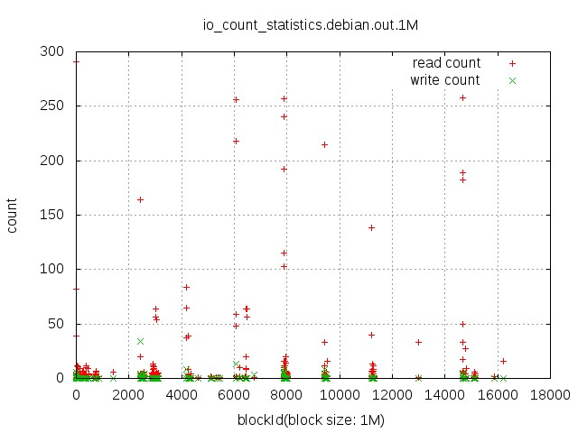
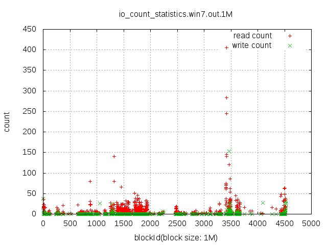
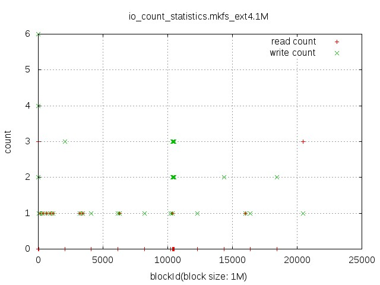
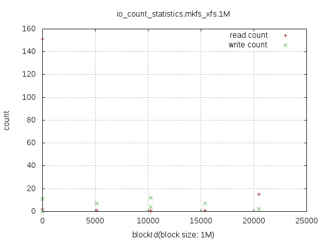

# 分析io的分布

---

该脚本用于分析io的分布并生成图表展示
## 使用方法
### 1.使用blktrace抓取io trace
因为这个脚本是解析blktrace抓取的io trace来分析io的分布，因此需要使用blktrace先抓trace，比如要抓取一块系统盘启动过程中的io trace，先在一个终端里执行如下命令：
```
# blktrace -d <device> -a complete -o - | blkparse -i - -o <outfile>
```
然后就可以启动系统盘，启动完成之后，就可以使用ctrl+c停止blktrace。
上面blktrace命令输出的结果类似如下，格式说明参考blktrace User Guide
```
254,16   0        2     0.021174925     0  C   R 78156240 + 576 [0]
254,16   0        3     0.054676020     0  C  WS 43325520 + 216 [0]
```
其中的"78156240 + 576"的单位是扇区(512Bytes)
下面就使用提供的脚本来分析io情况。
### 2.使用脚本分析io trace
脚本使用帮助如下：
```
$ python blkio_parse.py 
Usage: blkio_parse.py [options]

Options:
  -h, --help            show this help message and exit
  -f FILENAME, --filename=FILENAME
                        Specifies source data file
  -b BLOCKSIZE, --blocksize=BLOCKSIZE
                        Specifies block size(Bytes,K,M)
  -o OUTFILE, --outFile=OUTFILE
                        Specifies output file
```
这个脚本主要的功能就是分析blktrace的结果里每个io的大小，偏移，读写方式，然后按照指定的块大小计算落到这个区间的读写io有多少，并且最后使用gnuplot将结果绘制成图。示例如下：
```
$ python blkio_parse.py -f debian.bin -b 1M -o debian.out
totalReadSize: 65393664
totalWriteSize: 1507328

    gnuplot <<EOF
    
    set grid
    set size 1,1
    set term jpeg
    set output 'io_count_statistics.debian.out.1M.jpg'
    set title "io_count_statistics.debian.out.1M"
    set ylabel "count"
    set xlabel "blockId(block size: 1M)"
    set style data points
    plot "debian.out.1M" using 1:2 title "read count","debian.out.1M" using 1:3 title "write count"
EOF
```
### 3.启动盘和创建文件系统过程中io分布
分析了debian和win7系统启动过程中的io分布，以及创建ext4和xfs文件系统过程的io分布，结果如下：

1）debian启动过程中的读写io分布


2）win7系统启动过程中的读写io分布


3）创建ext4文件系统过程中的读写io分布


4）创建xfs文件系统过程中的读写分布

